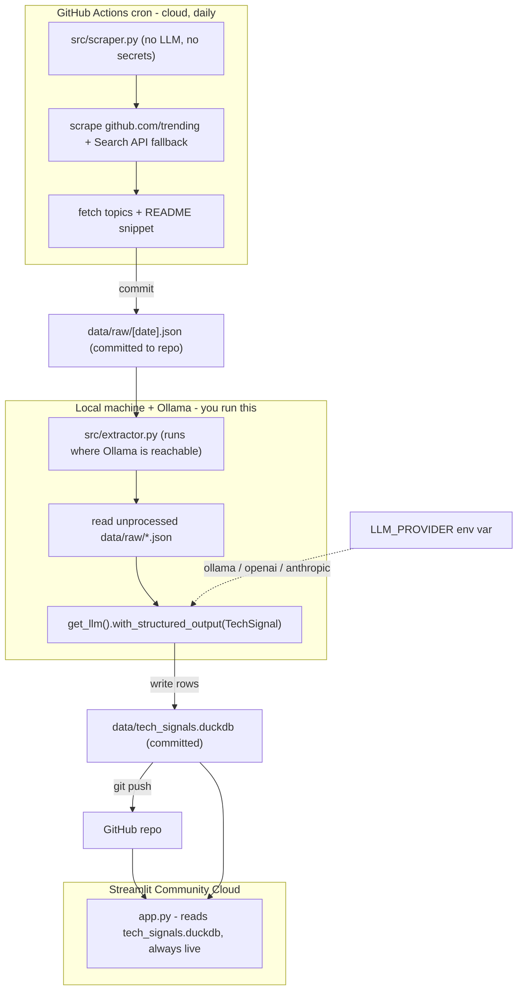

# GitHub Tech Radar Pipeline

A fully automated data pipeline that scrapes GitHub's trending repos daily, uses a **local LLM (Ollama `llama3.2:3b`)** to extract structured tech metadata from each repo's README and topics, stores everything in **DuckDB** as a rolling time-series, and renders a live **Tech Radar dashboard** (rising/falling tools by category) in **Streamlit + Plotly**.

The LLM is **provider-agnostic**: it runs on free local Ollama today and is hot-swappable to any cloud model (OpenAI / Anthropic) via a single env var.

## Architecture (provider-switch hybrid)



Why split this way: GitHub's cloud runners cannot reach Ollama on your laptop, so the **scrape** runs reliably in CI while the **LLM enrichment** runs locally where the model lives. The dashboard reads whatever is already in the DB, so it never goes down.

## Project layout

| Path | Purpose |
|---|---|
| `src/config.py` | Loads `.env`, exposes paths + tunables |
| `src/models.py` | `TechSignal` (LLM contract) + `RawRepo` Pydantic models |
| `src/llm_provider.py` | `get_llm()` factory keyed on `LLM_PROVIDER` |
| `src/scraper.py` | Scrape trending + README, write `data/raw/<date>.json` |
| `src/db.py` | DuckDB schema, inserts, idempotency helpers |
| `src/extractor.py` | Raw repos → structured signals → DuckDB |
| `src/queries.py` | Momentum / drilldown analytics queries |
| `dashboard/app.py` | Streamlit + Plotly dashboard |
| `.github/workflows/scrape.yml` | Daily scraper cron |

## Setup

Requires Python 3.12 (pinned to match CI and avoid missing wheels on newer Python). Uses [`uv`](https://github.com/astral-sh/uv); plain `pip` works too.

```bash
uv venv --python 3.12 .venv
source .venv/bin/activate          # Windows: .venv\Scripts\activate
uv pip install -r requirements.txt

cp .env.example .env               # then edit as needed
```

### Configure Ollama

Install Ollama and pull the model on the machine that will run extraction:

```bash
ollama pull llama3.2:3b
```

- **Extractor runs on the same machine as Ollama** (e.g. your Windows laptop):
  keep the default `OLLAMA_BASE_URL=http://localhost:11434`.
- **Extractor runs elsewhere (e.g. your Mac) but Ollama is on the Windows laptop:**
  point at the laptop's LAN IP and make sure Ollama listens on all interfaces.

```bash
# .env on the Mac
OLLAMA_BASE_URL=http://192.168.1.50:11434   # the Windows laptop's IP
```

On the Windows laptop, expose Ollama beyond localhost by setting the env var `OLLAMA_HOST=0.0.0.0` before starting Ollama (and allow port 11434 through the firewall).

## Run order

```bash
# 1. Scrape today's trending repos -> data/raw/<date>.json
python -m src.scraper

# 2. Enrich with the LLM -> data/tech_signals.duckdb
#    (skips days already in the DB; --force to re-process, --date to target one)
python -m src.extractor

# 3. Launch the dashboard
streamlit run dashboard/app.py
```

## Switching LLM provider

All LLM access goes through `get_llm()`. Change provider with one env var:

```bash
# Local, free (default)
LLM_PROVIDER=ollama
OLLAMA_MODEL=llama3.2:3b

# Cloud (when ready)
LLM_PROVIDER=openai
OPENAI_API_KEY=sk-...
# or
LLM_PROVIDER=anthropic
ANTHROPIC_API_KEY=sk-ant-...
```

No code changes required — `src/extractor.py` calls `get_llm()` regardless.

## DuckDB schema

```sql
CREATE TABLE tech_signals (
    scraped_date DATE,
    repo_name    VARCHAR,
    stars_today  INTEGER,
    language     VARCHAR,
    category     VARCHAR,
    tools        VARCHAR[],
    maturity     VARCHAR,
    confidence   FLOAT,
    use_case     VARCHAR
);
```

The momentum query uses `UNNEST(tools)` plus 7-day / 30-day windowed counts to compute a `momentum_score` (> 1.0 rising, < 1.0 cooling). See `src/queries.py`.

## Automation

`.github/workflows/scrape.yml` runs the scraper daily at 01:00 UTC (plus a manual `workflow_dispatch` trigger) and commits new `data/raw/*.json` back to the repo. LLM enrichment stays local for now; to move it into CI later, set `LLM_PROVIDER` + the matching API key as repo secrets and add an extractor step.

Optional: add a `GH_API_TOKEN` repo secret to raise GitHub API rate limits for README fetching.

## Deploy the dashboard (Streamlit Community Cloud)

1. Push this repo to GitHub.
2. On [share.streamlit.io](https://share.streamlit.io), create an app pointing at
   `dashboard/app.py` on your default branch.
3. It reads the committed `data/tech_signals.duckdb` and redeploys on each push.

## License

Released under the [MIT License](LICENSE).
